  <!-- Synthwave Header Image -->
  

   

  <!-- Neon Typing Effect -->
  <h1>
    
  </h1>

  <!-- Neon Social Badges -->
  

    
    
  

---

### 🌌 Ａｂｏｕｔ　Ｍｅ

*Entering Cyberspace... Data uploaded.*

- 🎓 **Currently:** Computer science student, learning the theory and building the practice.
- 🔭 **Current focus:** Producing things with AI — putting models to work inside real, running software.
- 🌱 **Currently exploring:** Agentic AI, LLM tooling, and the async Python plumbing that holds it together.
- 📚 **On the side:** Documentation — turning what I had to figure out the hard way into a reference that answers the question directly.
- ⚡ **Fun fact:** When I'm not building, I'm diving into the retro-future.

 

### 🚀 Ｆｅａｔｕｒｅｄ

**[The Professional Camera Guide — Samsung Galaxy S24 Ultra](https://github.com/Hamidreza-Ebrahimi/s24-ultra-camera-guide)**

A field manual for the S24 Ultra's camera system — what each of the four rear cameras actually is,
which zoom levels are real optics and which are sensor crops, how to drive Pro mode and Expert RAW
like a manual camera, and a scene-by-scene playbook from night cityscapes to astro to light trails.
Written in Markdown, built to HTML and PDF from a single source.

 

### 💻 Ｔｅｃｈ　Ｓｔａｃｋ

  <!-- Neon Tech Stack Badges (Black background with neon logos) -->
  
  
  
  
  
   
  
  
  
  
  

 

### 📊 Ｓｔａｔｓ

  
  

  

  

