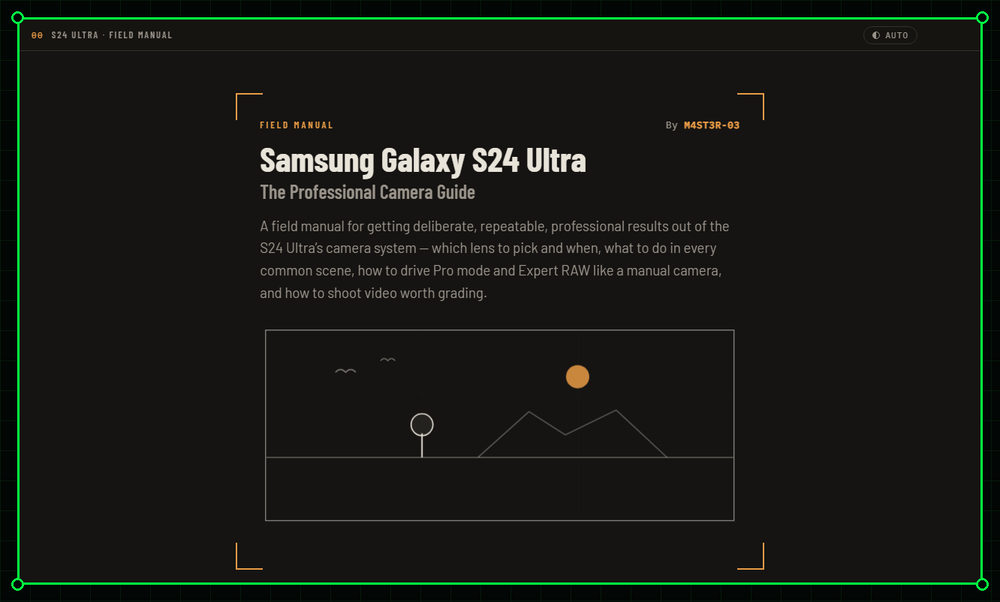

  

  <h1>
    
  </h1>

  

    
  

---

### About

- **Studying** computer science, learning the theory and building the practice alongside it.
- **Building** small, working software with AI in the loop: agents, LLM tooling, and the async Python plumbing that keeps them running when the API on the other end does not.
- **Writing** documentation that turns what I had to figure out the hard way into a reference that answers the question directly.

 

### Featured

**[The Professional Camera Guide — Samsung Galaxy S24 Ultra](https://github.com/Hamidreza-Ebrahimi/s24-ultra-camera-guide)**

A field manual for the S24 Ultra's camera system: what each of the four rear cameras actually is,
which zoom levels are real optics and which are sensor crops, how to drive Pro mode and Expert RAW
like a manual camera, and a scene-by-scene playbook from night cityscapes to astro to light trails.
Written in Markdown and built to HTML and PDF from a single source.

  
  
  

 

### Tools

  
  
  
  
  
   
  
  
  
  

